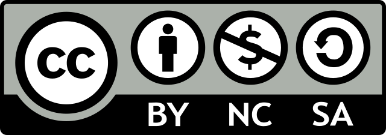

--- 
title: "Guide to Wise Investing"
author: "Junghoon Shin"
date: "`r paste({t = Sys.time(); attributes(t)$tzone = 'Asia/Seoul'; t}, 'KST')`"
site: bookdown::bookdown_site
documentclass: book
bibliography: [book.bib, packages.bib]
csl: apa-with-abstract.csl
biblio-style: apalike
link-citations: yes
url: 'https\://bookdown.org/junghoonshin/guide-to-wise-investing/'
github-repo: "junghoon-shin/guide-to-wise-investing"
cover-image: "images/mathieu-stern-1zO4O3Z0UJA-unsplash.jpg"
apple-touch-icon: "images/bull.svg"
apple-touch-icon-size: 120
favicon: "images/bull.svg"
description: "Investment databook containing business financials, industry and market environments, and global economy"
---

```{r, include = F}
knitr::write_bib(c(.packages(), "bookdown", "knitr", "rmarkdown"), "packages.bib")
```

```{r, include = F}
if (!"remotes" %in% installed.packages()) {
  install.packages("remotes")
}

library(remotes)

if (!"facetscales" %in% installed.packages()) {
  install_github("zeehio/facetscales")
}

if (!"yfinance" %in% installed.packages()) {
  install_github("ljupch0/yfinance")
}

if (!"pacman" %in% installed.packages()) {
  install.packages("pacman")
}

if (!"BiocManager" %in% installed.packages()) {
  install.packages("BiocManager")
}

library(pacman)

p_load(bookdown,
       ComplexHeatmap,
       cowplot,
       DT,
       facetscales,
       furrr,
       ggpubr,
       googledrive,
       googlesheets4,
       grid,
       gridExtra,
       htmltools,
       httr,
       kableExtra,
       knitr,
       labeling,
       lubridate,
       magrittr,
       measurements,
       paleotree,
       pander,
       plotly,
       quantmod,
       RColorBrewer,
       rlist,
       rvest,
       scales,
       stringi,
       tidyquant,
       tidyverse,
       XML,
       yfinance)

options(bitmapType = "cairo")

options(gargle_oauth_email = "freeustand@gmail.com")

knitr::opts_chunk$set(echo = FALSE, 
                      message = FALSE, 
                      warning = FALSE, 
                      error = FALSE,
                      out.width = "100%", 
                      out.height = "100%", 
                      fig.width = 7, 
                      fig.height = 5,
                      dev = "png",
                      dev.args = list(bg = "transparent", type = "cairo"))

theme_set(theme_bw(base_family = "Lato"))

theme_update(plot.title = element_text(hjust = 0.5, vjust = 0.5),
             plot.margin = unit(c(5.5, 11, 5.5, 5.5), "points"),
             rect = element_rect(fill = "transparent"),
             plot.background = element_rect(color = "transparent"),
             legend.key = element_rect(fill = "transparent"),
             panel.background = element_rect(fill = "transparent"))

update_geom_defaults(geom = "text", new = list(family = "Lato"))
```

```{r}
read_html = function(url, which = integer(), header = T, trim = T, skip.rows = integer()) {
  readHTMLTable(rawToChar(GET(url)$content), which = which, header = header, trim = trim, skip.rows = skip.rows)
}

my_datatable = function(tbl, paging = F, pageLength = 5, scrollY = unit(700, "lines"), caption = NULL) {
  DT::datatable(tbl,
                options = list(dom = "lfrtip",
                               paging = paging,
                               pageLength = pageLength,
                               searching = T,
                               ordering = T,
                               scrollX = T, 
                               scrollY = scrollY,
                               fixedColumns = list(leftColumns = 1),
                               colReorder = list(realtime = F),
                               keys = T,
                               autoWidth = T,
                               initComplete = JS("function(settings, json) {", 
                                                 "$(this.api().table().header()).css({'font-size': '14px'});",
                                                 "}")),
                extensions = c("FixedColumns", "ColReorder", "KeyTable"),
              rownames = F,
              caption = caption) %>%
    formatStyle(columns = 1:ncol(tbl), fontSize = "14px")
}

make_percent = function(x, times) {
  (x * times) %>% round(1) %>% format(scientific = F, big.mark = ",", drop0trailing = T) %>% str_trim %>% {ifelse(. == "NA", ., str_c(., "%"))}
}

make_readable = function(x) case_when(abs(x) >= 1e12 ~ str_c(round(x/1e12, 1) %>% format(scientific = F, big.mark = ",", drop0trailing = T) %>% str_trim, "T"),
                                      abs(x) >= 1e9 ~ str_c(round(x/1e9, 1) %>% format(scientific = F, drop0trailing = T) %>% str_trim, "B"),
                                      abs(x) >= 1e6 ~ str_c(round(x/1e6, 1) %>% format(scientific = F, drop0trailing = T) %>% str_trim, "M"),
                                      abs(x) >= 1e3 ~ str_c(round(x/1e3, 1) %>% format(scientific = F, drop0trailing = T) %>% str_trim, "K"),
                                      T ~ round(x, 1) %>% format(scientific = F, drop0trailing = T) %>% str_trim)

make_numeric = function(x) {
  str_replace(x, ",", "") %>% {
    case_when(str_detect(., "T$") ~ as.numeric(str_replace(., "T", "")) * 1e12,
              str_detect(., "B$") ~ as.numeric(str_replace(., "B", "")) * 1e9,
              str_detect(., "M$") ~ as.numeric(str_replace(., "M", "")) * 1e6,
              str_detect(., "[Kk]$") ~ as.numeric(str_replace(., "[Kk]", "")) * 1e3)
  }
}

clean_name = function(name) {
  name %<>% 
    str_replace_all(c("-* ADR([, ]+|$)" = "",
                      "Common Stock([, ]+|$)" = "",
                      "(?<=[ ,a-z])Co(rporation|rp)*([., ]+|$)" = "",
                      "(?<=[ ,a-z])(Inc|INC|Ltd|SA|AG|NV|SE|PLC|Mfg|Holdings*|Class [A-Z])([., ]+|$)" = "",
                      "[,& ]+$" = "",
                      "\\s+" = " ")) %>% 
    str_trim
  
  case_when(name == "TAKE-TWO INTERACTIVE SOFTWARE" ~ "Take-Two Interactive",
            name == "QUALCOMM" ~ "Qualcomm",
            T ~ name)
}

clean_ceo_name = function(ceo) {
  str_replace_all(ceo, c("Mr\\.*\\s*" = "",
                         "Dr\\.*\\s*" = "",
                         "Ph\\.*D\\.*" = "",
                         "M\\.*B\\.*A\\.*" = "",
                         "J\\.*D\\.*" = "",
                         "D\\.*V\\.*M\\.*" = "",
                         "[, ]+$" = "")) %>% 
    str_trim
}

convert_ticker = function(google) {
  google %>% 
    str_replace("^(.+):(.+)$", "\\2.\\1") %>% 
    str_replace_all(c("\\.KRX" = ".KS",
                      "\\.KOSDAQ" = ".KQ",
                      "\\.NYSE" = "",
                      "\\.NASDAQ" = "",
                      "\\.CVE" = ".V",
                      "\\.EPA" = ".PA",
                      "\\.SWX" = ".SW",
                      "\\.AMS" = ".AS",
                      "\\.HKG" = ".HK",
                      "\\.TPE" = ".TW",
                      "\\.TYO" = ".T",
                      "RO\\.SW" = "ROG.SW"))
}

pairwise_cor = function(x, y = NULL) {
  if (is.null(y)) {
    r = matrix(NA, nrow = ncol(x), ncol = ncol(x), dimnames = list(colnames(x), colnames(x)))
    w = matrix(NA, nrow = ncol(x), ncol = ncol(x), dimnames = list(colnames(x), colnames(x)))
    
    for (var1 in  colnames(x)) {
      for (var2 in colnames(x)) {
        r[var1, var2] = cor(x[[var1]], x[[var2]], use = "pairwise.complete.obs")
        w[var1, var2] = map2_lgl(!is.na(x[[var1]]), !is.na(x[[var2]]), ~all(.x, .y)) %>% sum
      }
    }
  }
  
  else {
    r = matrix(NA, nrow = ncol(x), ncol = ncol(y), dimnames = list(colnames(x), colnames(y)))
    w = matrix(NA, nrow = ncol(x), ncol = ncol(y), dimnames = list(colnames(x), colnames(y)))
    
    for (var1 in  colnames(x)) {
      for (var2 in colnames(y)) {
        r[var1, var2] = cor(x[[var1]], y[[var2]], use = "pairwise.complete.obs")
        w[var1, var2] = map2_lgl(!is.na(x[[var1]]), !is.na(y[[var2]]), ~all(.x, .y)) %>% sum
      }
    }
  }
  
  return(list(r = r, w = w))
}

weighted_mean = function(index_cor) {
  r = simplify2array(index_cor$r)
  w = simplify2array(index_cor$w)
  t = simplify2array(index_cor$w) %>% apply(1:2, function(x) sum(x, na.rm = T))
  apply(r * w, 1:2, function(x) sum(x, na.rm = T)) / t
}
```

```{r}
qual_col_pals = brewer.pal.info[brewer.pal.info$category == 'qual',]
qual_col_vector = unlist(mapply(brewer.pal, qual_col_pals$maxcolors, rownames(qual_col_pals))) %>% unique

front = c(5, 6, 52:57)
back = c(1, 10, 12:15, 17:18, 22, 24, 26:47, 49)
fill_color = c(qual_col_vector[front], qual_col_vector[-c(front, back)], qual_col_vector[back])

front = c(5, 6, 52:57)
back = c(1, 4, 10, 12:15, 17:18, 22, 24, 26:47, 49)
line_color = c(qual_col_vector[front], qual_col_vector[-c(front, back)], qual_col_vector[back])

monthago = (today() - 30) %>% as.character %>% str_replace(" ", "")
yearago = (today() - 365) %>% as.character %>% str_replace(" ", "")
twoyearsago = (today() - round(365.25 * 2)) %>% as.character %>% str_replace(" ", "")
fiveyearsago = (today() - round(365.25 * 5)) %>% as.character %>% str_replace(" ", "")
thirtyyearsago = (today() - round(365.25 * 30)) %>% as.character %>% str_replace(" ", "")
fiftyyearsago = (today() - round(365.25 * 50)) %>% as.character %>% str_replace(" ", "")

thishour = now("Asia/Seoul") %>% strftime(format = "%H") %>% as.numeric
thisyear = today() %>% strftime("%Y") %>% as.numeric
thismonth = today() %>% strftime("%m")
```

# Preface {#preface .unnumbered}

<div style = "text-align: center">

 on [Unsplash](https://unsplash.com/)](images/mathieu-stern-1zO4O3Z0UJA-unsplash.jpg)

</div>

When I first stepped into the investment world, there was just too much information all over the newspapers, websites, books, YouTube, and even lunch table gossips which all seemed to be of the utmost importance to me. Some believed it was the perfect time to invest in the stock market, while others insisted that the whole market was significantly overheated by repeated fiscal stimulus packages from the government and we all should prepare for the impending market crash. I was so confused that I soon gave up deciding where to invest my money on my own, and instead relied upon some random 1M-subscriber stock YouTubers, trying to copy what they were doing as closely as I could. It seemed a fairly good strategy until I read what [one of the most successful investors on the planet](#buffett) once uttered: *"Risk comes from not knowing what you're doing."* It was painful because that was exactly what I was doing --- I didn't know what I was doing.

From that moment on, I tried to read what the great investors wrote, collect seemingly helpful information, distinguish between useful and useless ones as best as I could, and make my own investment decision whether it was correct or not. It was not an easy task at first. As I rely heavily on Google to get my work done and get surprised by its versatility almost every day, I thought that investing in Google might be a good idea. I was smart enough to know that Alphabet Inc. was the parent company of Google, so I decided to do some research into it. All I really did was to search it up on Google. In about 0.5 seconds, Google spat out 166,000,000 results on the screen. It was not long after I scrolled down to see if anything useful was there that I totally gave up. After giving a few more tries to some other companies, I realized that there weren't many sources of information that fit my needs exactly: something easy, concise, yet informative.

After struggling for quite a while I set about working on this project. It was initially aimed to serve as my personal resource of automatically updated financial data which include only understandable and useful information that would aid me to make an unbiased and premeditated investment decision. As the project went along, however, it slowly evolved into what I thought could also help others who were interested in investing but found existing sources of information [exhausting](https://www.sec.gov/ix?doc=/Archives/edgar/data/320193/000032019320000096/aapl-20200926.htm). This project is designed to help specifically those laymen who seek a reliable source of investment data that does not take a whole lot of time and professional-level financial knowledge to digest. I made my best effort to collate only information that most non-expert investors like me can easily apply to their investment practice right away.

This is a free-to-use, public-access, ongoing project still in its infant stage, and I am always open to suggestions from whoever hopes to make it better. Please feel free to [contact me](#author), or even better make a [pull request](https://docs.github.com/en/github/collaborating-with-issues-and-pull-requests/about-pull-requests) (click the edit button on the top left corner of the page you want to edit) anytime anywhere. This project has been hugely inspired by [Warren Buffett](https://www.berkshirehathaway.com/letters/letters.html), @town2018, @graham2003, @lee2020, and @kim2019. All data published on this website (including [my own portfolio composition](#portfolio)) are automatically retrieved from [public resources](#resources) and updated every hour. They were last updated at **`r paste(now("Asia/Seoul"), "KST")`**. Check them out daily and find out how easily investment can be incorporated into your life.\
\

{width=180px}

This project is licensed under a [Creative Commons Attribution-NonCommercial-ShareAlike 4.0 International (CC BY-NC-SA 4.0)](https://creativecommons.org/licenses/by-nc-sa/4.0/). Some pages may contain materials that are subject to copyright, in which case you will see the copyright notice.
