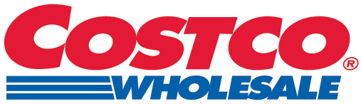

# Munger and Town's lessons^[Contents of this chapter are mostly adapted from @town2018.] {#town}

## Charlie Munger's four principles of investing

1. It must be a business within your circle of competence.
2. The business should have [*intrinsic* characteristics](#moat) that give it a durable competitive advantage.
3. The business should have [management](#management) with integrity and talent.
4. The business should be available for a fair price that gives a "margin of safety."

## Five and a half Moats {#moat}

```{r}
tibble(Moat = c("Strong brand", 
                       "Painful switching<br>(Network effect)", 
                       "Toll bridge<br>(Monopoly)", 
                       "Secret<br>(Patent)", 
                       "Price"),
              Example = c("{height=80px}",
                          "{height=80px} {height=80px} {height=80px}",
                          "{height=80px}",
                          "{height=80px} {height=80px}",
                          "{height=80px}")) %>% 
  kbl(escape = F, col.names = colnames(.), caption = "Five and a half Moats that determine the durable competitive advantage of a business with nice examples") %>%
  kable_styling(bootstrap_options = c("striped", "hover", "condensed", "responsive"),
                full_width = F, position = "left")
```

## Big four numbers

1. Sales (a.k.a. revenue, top line)
2. Net income (a.k.a. net profit, bottom line)
3. Book value (a.k.a. equity) + dividends (if any)
4. Operating cash flow

## Management numbers {#management}

1. Return on equity
2. Return on invested capital (equity + debt)
3. Debt
